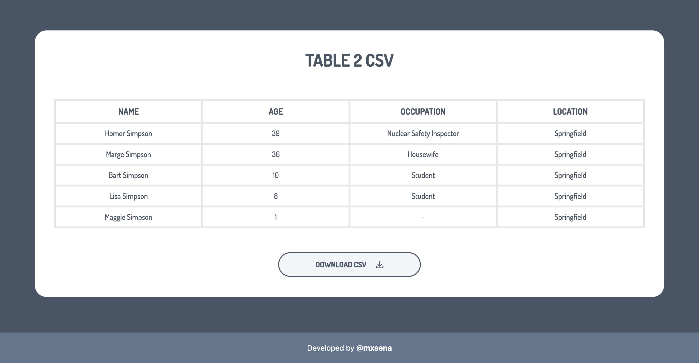

# TABLE 2 CSV

A lightweight JavaScript function that converts HTML tables into downloadable CSV files. This tool simplifies data export from web pages, making it easy to save and share table data in a universally accessible format.

A lightweight JavaScript function that converts HTML tables into downloadable CSV files. This tool simplifies data export from web pages, making it easy to save and share table data in a universally accessible format.
 
